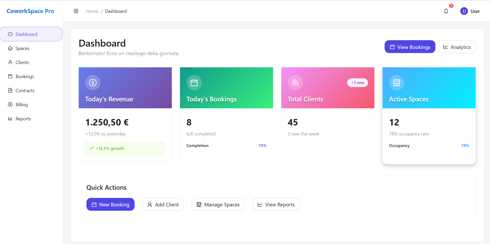
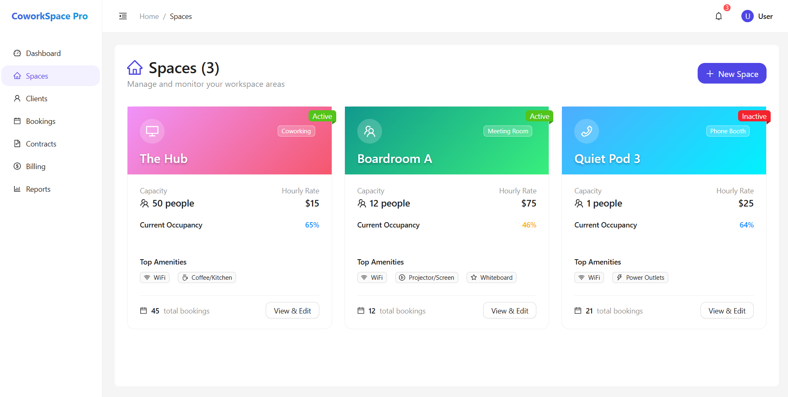
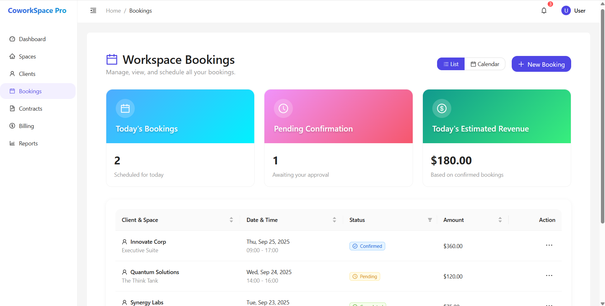
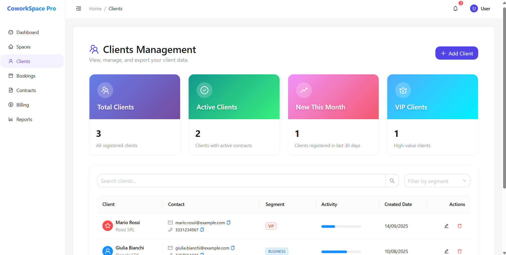
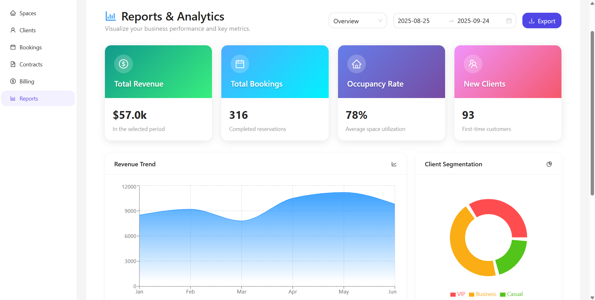

# CoworkSpace Manager Pro

A complete SaaS solution for coworking space management with real-time analytics, booking calendar, advanced CRM, automated billing, contract management, and smart reporting.


## 🚀 Live Demo

**Landing Page**: [https://coworkspace-landing.vercel.app](https://coworkspace-landing.vercel.app)

**Demo Credentials**:
- Email: `admin@opuscentersrl.it`
- Password: `admin123`

> **Note**: This is a demo version with sample data for evaluation purposes only.

## ✨ Features

### Core Management
- **Real-time Dashboard** - KPI cards, statistics, and growth metrics
- **Space Management** - CRUD operations for offices, meeting rooms, coworking desks
- **Advanced CRM** - Client database with segmentation and detailed history
- **Booking System** - Calendar view with conflict detection and status management
- **Automated Billing** - Invoice generation, VAT calculation, payment tracking
- **Contract Management** - Digital contracts with automatic renewal monitoring
- **Smart Reports** - Advanced analytics with interactive charts and trend analysis

### Technical Features
- Modern React 18 architecture with Ant Design
- RESTful API with Express.js and Prisma ORM
- JWT authentication system
- Responsive design with glassmorphism effects
- Real-time data updates
- Export functionality (PDF, Excel)

## 🛠️ Tech Stack

### Frontend
- **React.js 18** - Modern UI library
- **Ant Design** - Enterprise-class UI components
- **Redux Toolkit** - State management
- **Recharts** - Data visualization
- **Vite** - Fast build tool

### Backend
- **Node.js** - Runtime environment
- **Express.js** - Web framework
- **Prisma ORM** - Database toolkit
- **SQLite** - Development database
- **JWT** - Authentication
- **bcryptjs** - Password hashing

## 📦 Installation

### Prerequisites
- Node.js 18+ 
- npm or yarn

### Setup Steps

1. **Clone the repository**
```bash
git clone https://github.com/your-username/coworkspace-manager-pro.git
cd coworkspace-manager-pro
```

2. **Install dependencies**
```bash
# Install root dependencies
npm install

# Install frontend dependencies
cd frontend
npm install

# Install backend dependencies
cd ../backend
npm install
```

3. **Setup environment variables**
```bash
# Backend .env
cd backend
cp .env.example .env
# Edit .env with your configuration
```

4. **Setup database**
```bash
# Generate Prisma client
npx prisma generate

# Run migrations
npx prisma migrate dev

# Seed database with sample data
npx prisma db seed
```

5. **Start development servers**
```bash
# Terminal 1 - Backend
cd backend
npm run dev

# Terminal 2 - Frontend
cd frontend
npm run dev
```

6. **Access the application**
- Frontend: http://localhost:3000
- Backend API: http://localhost:5000

## 🎯 Usage

### Demo Login
Use the provided demo credentials to explore all features:
- **Email**: admin@opuscentersrl.it
- **Password**: admin123

### Sample Data
The application comes pre-loaded with:
- 3 sample spaces (Office, Coworking Desk, Meeting Room)
- 1 demo client (John Doe)
- Sample bookings and contracts
- Mock financial data for reporting

## 📊 Screenshots

### Dashboard


### Space Management


### Booking Calendar


### Client Management


### Reports & Analytics


## 🔧 Configuration

### Environment Variables

**Backend (.env)**
```
DATABASE_URL="file:./dev.db"
JWT_SECRET="your-super-secret-jwt-key"
PORT=5000
```

**Frontend (.env)**
```
VITE_API_URL=http://localhost:5000
```

## 📈 Project Structure

```
coworkspace-manager-pro/
├── frontend/                 # React application
│   ├── src/
│   │   ├── components/      # Reusable components
│   │   ├── pages/          # Page components
│   │   ├── store/          # Redux store and slices
│   │   └── App.jsx         # Main application component
│   ├── public/             # Static assets
│   └── package.json
├── backend/                 # Express.js API
│   ├── src/
│   │   ├── controllers/    # Route handlers
│   │   ├── routes/         # API routes
│   │   ├── middleware/     # Custom middleware
│   │   └── server.js       # Server entry point
│   ├── prisma/
│   │   ├── schema.prisma   # Database schema
│   │   └── seed.js         # Database seeding
│   └── package.json
├── landing/                 # Marketing website
│   ├── index.html          # Landing page
│   ├── privacy-policy.html # GDPR compliance
│   └── terms-of-service.html
└── README.md
```

## 🚀 Deployment

### Frontend (Vercel)
```bash
cd frontend
npm run build
# Deploy to Vercel
```

### Backend (Railway/Heroku)
```bash
cd backend
# Configure production database
# Deploy to your preferred platform
```

## 🤝 Contributing

We welcome contributions! Please see our [Contributing Guidelines](CONTRIBUTING.md) for details.

### Development Workflow
1. Fork the repository
2. Create a feature branch (`git checkout -b feature/amazing-feature`)
3. Commit your changes (`git commit -m 'Add amazing feature'`)
4. Push to the branch (`git push origin feature/amazing-feature`)
5. Open a Pull Request

## 📝 License

This project is licensed under the MIT License - see the [LICENSE](LICENSE) file for details.

## 🔒 Security

This is a demo application with mock data. For production use:
- Change all default credentials
- Use environment variables for secrets
- Implement proper user authentication
- Use production-grade database
- Add rate limiting and security headers

## ⚠️ Disclaimer

This is an **early access demo** version with sample data for evaluation purposes only. No real payment processing is active. The application is not intended for production use without proper security implementation.

## 📞 Contact

**Francesco Ciardo** - Developer & Creator
- Email: francesco.ciardo@coworkspace-pro.com
- Project Link: [https://github.com/your-username/coworkspace-manager-pro](https://github.com/your-username/coworkspace-manager-pro)
- Live Demo: [https://coworkspace-landing.vercel.app](https://coworkspace-landing.vercel.app)

## 🙏 Acknowledgments

- Ant Design team for the excellent UI components
- Prisma team for the amazing ORM
- React team for the powerful frontend library
- All contributors and supporters of this project

---

**Built with ❤️ by Francesco Ciardo**